# معماری پروژه Learnfolio

این سند به تشریح معماری کلی پروژه، تکنولوژی‌های استفاده شده و نحوه تعامل اجزای مختلف با یکدیگر می‌پردازد.

## نمای کلی (High-Level Overview)

پروژه Learnfolio یک وب اپلیکیشن مدرن است که بر پایه معماری مبتنی بر سرویس (Service-Based Architecture) و با استفاده از کانتینرها توسعه داده شده است. این پروژه از یک بخش `backend` (نوشته شده با Django) و یک بخش `frontend` (که به صورت جداگانه توسعه می‌یابد) تشکیل شده است.

*نمودار بالا نمای کلی از تعامل اجزای سیستم را نشان می‌دهد.*

---

## اجزای اصلی معماری

### ۱. Backend (Django)
هسته اصلی پروژه که با فریمورک Django و Django REST Framework (DRF) پیاده‌سازی شده است. مسئولیت‌های اصلی آن عبارتند از:
- **API Endpoints**: ارائه APIهای RESTful برای مدیریت کاربران، احراز هویت، و سایر منطق‌های کسب‌وکار.
- **مدیریت دیتابیس**: تعامل با پایگاه داده PostgreSQL از طریق Django ORM.
- **پردازش‌های پس‌زمینه**: اجرای وظایف زمان‌بر یا دوره‌ای با استفاده از Celery.

### ۲. Frontend
بخش مربوط به رابط کاربری که با `backend` از طریق APIها در ارتباط است. این بخش به صورت جداگانه توسعه و اجرا می‌شود.

### ۳. پایگاه داده (PostgreSQL)
یک پایگاه داده رابطه‌ای قدرتمند که برای ذخیره‌سازی دائمی داده‌های پروژه (مانند اطلاعات کاربران، پروفایل‌ها و ...) استفاده می‌شود. این سرویس در یک کانتینر Docker مجزا اجرا می‌شود.

### ۴. صف پیام (RabbitMQ)
به عنوان یک Message Broker برای ارتباط بین سرویس `web` و `celery` عمل می‌کند. وظایف ارسال شده از Django در این صف قرار گرفته و توسط Worker-های Celery برای پردازش برداشته می‌شوند.

### ۵. وظایف پس‌زمینه (Celery)
برای اجرای وظایف غیرهمزمان (Asynchronous) و زمان‌بندی شده استفاده می‌شود:
- **Celery Worker**: پردازش وظایفی مانند ارسال ایمیل یا پیامک را بر عهده دارد تا پاسخ‌دهی API سریع‌تر شود.
- **Celery Beat**: برای اجرای وظایف زمان‌بندی شده (مثلاً پاک‌سازی دوره‌ای توکن‌های منقضی شده) به کار می‌رود.

### ۶. کش (Redis)
یک سرویس ذخیره‌سازی داده در حافظه (In-memory) که برای دو منظور اصلی استفاده می‌شود:
- **Caching**: کش کردن داده‌های پرتکرار برای کاهش بار روی دیتابیس و افزایش سرعت.
- **Celery Result Backend**: ذخیره‌سازی نتایج وظایف اجرا شده توسط Celery.

---

## تکنولوژی‌ها و کتابخانه‌های کلیدی

| دسته                | تکنولوژی/کتابخانه                                | کاربرد                                                      |
|---------------------|--------------------------------------------------|--------------------------------------------------------------|
| **Backend**         | `Django`, `Django REST Framework`                | فریمورک اصلی و ساخت APIهای RESTful                           |
| **Authentication**  | `djangorestframework-simplejwt`                  | احراز هویت مبتنی بر توکن (JWT)                                |
| **Async Tasks**     | `Celery`, `RabbitMQ`                             | مدیریت و اجرای وظایف پس‌زمینه و زمان‌بندی شده                |
| **Database**        | `PostgreSQL`, `psycopg2-binary`                  | پایگاه داده اصلی و درایور اتصال به آن                         |
| **Caching**         | `Redis`, `django-redis`                          | کش سرور و بک‌اند نتایج Celery                                |
| **API Docs**        | `drf-spectacular`                                | ساخت خودکار مستندات API (Swagger/Redoc)                       |
| **Environment**     | `Docker`, `Docker Compose`                       | کانتینرسازی و مدیریت چرخه حیات سرویس‌ها                      |
| **Security**        | `django-cors-headers`, `Cloudflare Turnstile`    | مدیریت CORS و محافظت در برابر ربات‌ها (Captcha)               |
| **Logging**         | `logging.config.dictConfig`                      | سیستم لاگ‌گیری ساختاریافته و سفارشی                          |

---

## ساختار پروژه

ساختار پروژه به گونه‌ای طراحی شده که توسعه و نگهداری آن ساده باشد:

- **`backend/`**: شامل تمام کدهای مربوط به Django.
  - **`backend/settings/`**: تفکیک تنظیمات بر اساس محیط (`base.py`, `dev.py`, `prod.py`).
  - **`accounts/`**: اپلیکیشن مسئول مدیریت کاربران و احراز هویت.
  - **`core/`**: اپلیکیشن شامل ابزارهای مشترک، مدیریت خطاها و مدل‌های پایه.
- **`docs/`**: مستندات پروژه در فرمت Markdown.
- **`docker-compose.yml`**: فایل اصلی تعریف و پیکربندی سرویس‌های Docker.
- **`.env`**: فایل متغیرهای محیطی برای پیکربندی پروژه (در Git قرار نمی‌گیرد).
